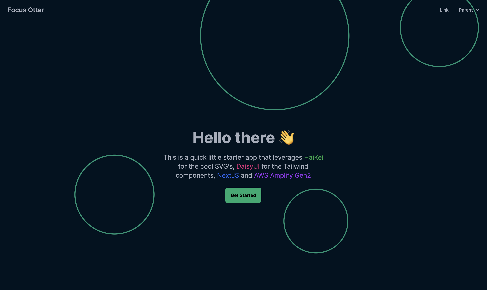

# Fullstack Gen2 Starter



> 🚨 This is a personal repo. Not to be confused with the starter repo offered by the AWS Amplify team

This repository provides a quick and easy way to get started with a simple full-stack project powered by NextJS, Tailwind, DaisyUI, and AWS Amplify Gen2. The goal is to serve as a personal starter template for building modern web applications with real-time data capabilities and user authentication.

## Features

- **Frontend**: NextJS application using the new app router, Tailwind CSS, and DaisyUI for styling
- **Backend**: AWS Amplify Gen2 powered backend with the following resources:
  - **Data**: AWS AppSync (GraphQL API) with real-time websocket subscriptions, backed by DynamoDB
  - **Auth**: Amazon Cognito for user authentication (email sign-in)

## Getting Started

1. Clone the repository:

```sh
git clone https://github.com/focusOtter/fullstack-gen2-starter.git
```

2. Install dependencies and start the AWS Amplify sandbox:

```sh
npm install && npm run ampx sandbox
```

3. Start the NextJS development server in a separate terminal tab:

```sh
npm run dev
```

The application should now be running locally at `http://localhost:3000`.

## Contributing

Contributions are welcome! If you find any issues or have suggestions for improvements, please create a new issue or submit a pull request. For major changes, it's recommended to open an issue first to discuss the proposed changes.
