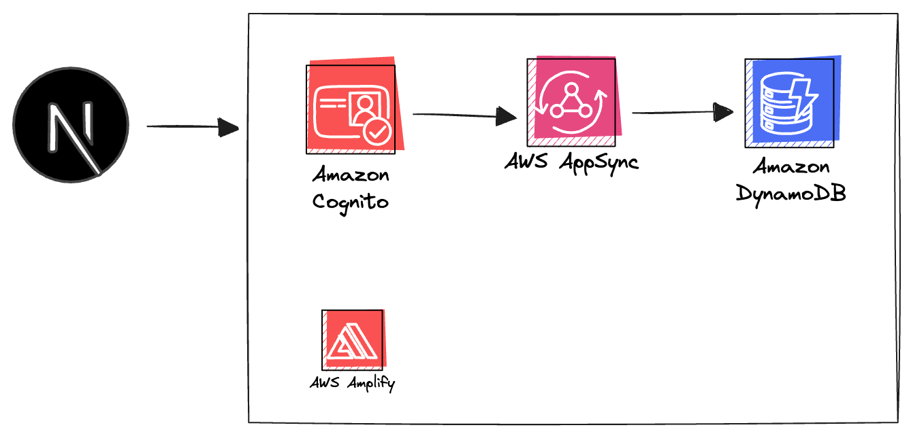

# SignalSquirrel Trading Platform 🐿️


A modern, AI-powered trading signals platform built with Next.js, AWS Amplify, and Tailwind CSS.

## Features



- **AI-Powered Trading Signals**: Real-time market analysis and intelligent trading recommendations
- **User Authentication**: Secure authentication with AWS Cognito and user groups
- **Admin Panel**: Complete user management system with group assignment capabilities
- **Responsive Design**: Modern, mobile-first UI with custom color palette
- **Real-time Dashboard**: Live trading statistics and signal monitoring

## Tech Stack

- **Frontend**: NextJS 14, React 18, TypeScript
- **Styling**: Tailwind CSS, DaisyUI
- **Authentication**: AWS Amplify, Cognito
- **Backend**: AWS Lambda, Cognito User Pools
- **Deployment**: AWS Amplify

## Color Palette

- **Primary**: Sky Blue (#3A9FF7) - Friendly, optimistic, and tech-forward
- **Secondary**: Warm Tangerine (#FF8A3D) - Playful and energizing
- **Accent Green**: Fresh Green (#4ADE80) - Growth and positivity
- **Accent Violet**: Violet (#8B5CF6) - Creativity and fun
- **Neutral Off-White**: (#F9FAFB) - Clean backgrounds
- **Neutral Charcoal**: (#1F2937) - Professional text

## Getting Started

1. Clone the repository:

```sh
git clone <repository-url>
cd alchemy-trading
```

2. Install dependencies and start the AWS Amplify sandbox:

```sh
npm install && npx ampx sandbox
```

3. Start the NextJS development server in a separate terminal tab:

```sh
npm run dev
```

The application should now be running locally at `http://localhost:3000`.

## Project Structure

```
├── app/                    # Next.js app directory
│   ├── admin/             # Admin panel pages
│   ├── auth/              # Authentication pages
│   ├── dashboard/         # User dashboard
│   ├── profile/           # User profile page
│   ├── signals/           # Trading signals page
│   └── page.tsx           # Home page
├── components/            # Reusable React components
├── amplify/               # AWS Amplify backend configuration
│   ├── auth/             # Cognito authentication setup
│   ├── functions/        # Lambda functions
│   └── backend.ts        # Backend configuration
└── public/               # Static assets
    └── signalsquirrel.png # Platform logo
```

## User Roles

- **Admin**: Full access to user management, group assignment, and platform administration
- **Premium**: Enhanced features and priority signal access
- **User**: Basic access to trading signals and dashboard

## Features Overview

### Authentication
- Email-based registration and login
- User groups (admin, premium, user)
- Secure session management

### Dashboard
- Trading statistics and performance metrics
- Quick actions and navigation
- Account status and plan information

### Signals
- Real-time trading signal display
- Confidence scoring and filtering
- Signal status tracking (active, completed, expired)

### Admin Panel
- User management and group assignment
- Lambda-powered backend operations
- Comprehensive user statistics

## Contributing

Contributions are welcome! If you find any issues or have suggestions for improvements, please create a new issue or submit a pull request. For major changes, it's recommended to open an issue first to discuss the proposed changes.